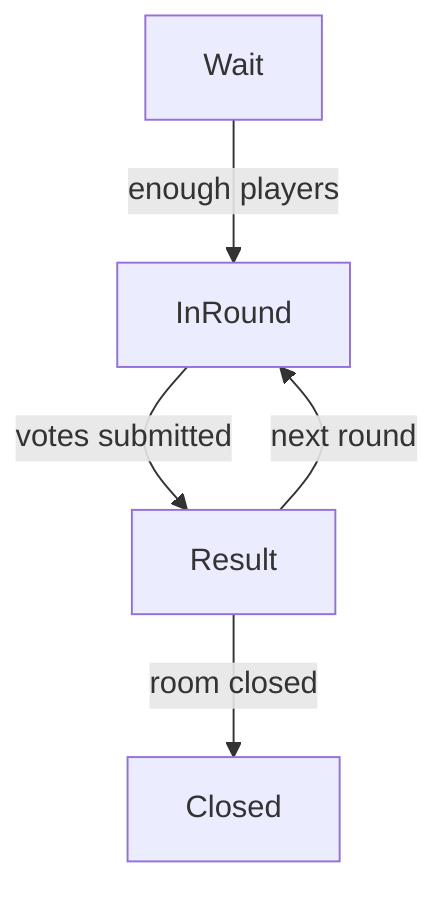

# 📑 EMOGUCHI API 仕様書 v3 (音声録音対応)

> **バージョン:** `v1.1`  
> **最終更新:** 2026-01-10

本ドキュメントは、**音声録音・再生機能付きリアルタイム感情推測ゲーム EMOGUCHI** の **REST + WebSocket** API 仕様を定義する。音声録音/再生、データベース統合、Socket.IO音声送信機能を含む。実装言語は **FastAPI (Python)**、クライアントは **Next.js + Socket.IO** を想定。

---

## 1. アーキテクチャ概要
| レイヤ | プロトコル | 主な責務 |
|--------|-----------|-----------|
| **管理系 API** | REST (`/api/v1/…`) | ルーム生成・破棄、LLM セリフプリフェッチ等 |
| **ゲーム進行** | WebSocket (Socket.IO) | ラウンド開始通知、投票、結果配信、音声送信 |
| **音声処理** | WebSocket (Socket.IO) | 音声録音データの送受信、リアルタイム音声配信 |
| **デバッグ** | REST (`/api/v1/debug/…`) | 開発時のみ。要 `X-Debug-Token` |

### ハイブリッドステート管理（メモリ + DB）
- ルーム／プレイヤー情報は **プロセス内メモリ辞書** に保持（高速アクセス）。
- 音声録音データ、MACアドレス、演技感情は **データベース** に永続化。
- ロジック層からは `StateStore` 抽象クラス経由でアクセスし、PostgreSQL 実装に対応。

---

## 2. 認証・権限制御
| トークン | 付与タイミング | 送付方法 | 権限 |
|---------|--------------|---------|------|
| **hostToken** | ルーム作成 (`POST /rooms`) 時に応答ヘッダ `X-Host-Token` | REST: `Authorization: Bearer <token>`<br>WS: `auth: { hostToken }` | ルーム設定変更・強制終了 |
| **debugToken** | 環境変数 `DEBUG_API_TOKEN` | REST: `X-Debug-Token` | デバッグ・メトリクス取得|

> ★ ゲストプレイヤーはトークン不要で参加可（playerName だけ送付）。

---

## 3. REST API 定義 (`/api/v1` プレフィックス)
| # | メソッド & パス | 説明 | 認証 | Request `body` | Response `200` | Response Model |
|---|----------------|------|------|----------------|---------------|---------------|
| 1 | **POST** `/rooms` | ルームを新規作成 | なし | `{ mode, voteType, speakerOrder }` | `{ roomId, hostToken }` | `RoomCreated` |
| 2 | **GET** `/rooms/{roomId}` | ルームの現在状態を取得 | 任意 | – | `RoomState` | – |
| 3 | **DELETE** `/rooms/{roomId}` | ルームを強制終了 | hostToken | – | `{ ok: true }` | – |
| 4 | **POST** `/rooms/{roomId}/prefetch` | 次ラウンド用セリフを LLM で先読み | hostToken | `{ batchSize }` | `{ phrases[] }` | `PrefetchResult` |
| – | – | – | – | – | – | – |
| 9 | **GET** `/debug/rooms` | 全ルーム一覧（開発用） | debugToken | – | `{ rooms[] }` | – |

### 3.1 Pydantic Response Models (抜粋)
```python
class RoomCreated(BaseModel):
    roomId: str
    hostToken: str

class RoomState(BaseModel):
    roomId: str
    players: list[str]
    phase: Literal["waiting","in_round","result"]
    config: RoomConfig
```

---

## 4. WebSocket (Socket.IO) イベント定義
| イベント名 | 方向 | Payload 型 | 説明 | ACK |
|------------|------|------------|------|-----|
| `room_created` | S → C | `RoomState` | 参加時の初期ルーム情報 | – |
| `join_room` | C → S | `{ roomId, playerName }` | ルーム参加要求 | ✔︎ |
| `player_joined` | S → C | `{ playerName }` | 新規参加者通知 | – |
| `round_start` | S → C | `{ roundId, phrase, votingChoices }` | ラウンド開始 | – |
| `speaker_emotion` | S → C | `{ emotionId, emotionName }` | スピーカーのみに感情通知 | – |
| `submit_vote` | C → S | `{ roundId, emotionId }` | リスナー投票 | ✔︎ |
| `round_result` | S → C | `{ roundId, correctEmotion, scores[] }` | 結果発表 | – |
| **`audio_send`** | **C → S** | **`{ audio: ArrayBuffer }`** | **音声録音データ送信** | **✔︎** |
| **`audio_received`** | **S → C** | **`{ audio: ArrayBuffer, speaker_name }`** | **音声データ受信通知** | **–** |
| `error` | S → C | `ErrorPayload` | 共通エラー | – |

### 4.1 音声関連イベント詳細
- **`audio_send`**: スピーカーがMediaRecorder APIで録音したWebM/Opus形式の音声データをArrayBufferとして送信
- **`audio_received`**: 他のプレイヤーに音声データをブロードキャスト（送信者は除外）
- 音声データは最大10MBまで対応（`max_http_buffer_size`設定）

### 4.2 ErrorPayload
```jsonc
{
  "code": "EMO-404",
  "message": "Room not found"
}
```
- REST エラーは `HTTP 4xx/5xx` + 同じ JSON ボディ。
- WebSocket は `error` イベントで送出。

---

## 5. CORS / Origin ポリシー
```python
ALLOWED_ORIGINS = [
    "http://localhost:3000",   # dev
    "https://emoguchi.vercel.app"  # prod
]
```

---

## 6. データベース統合 & 永続化
### 6.1 実装済みモデル
```python
class AudioRecording(BaseModel):
    id: str = Field(default_factory=lambda: str(uuid.uuid4()))
    round_id: str
    speaker_id: str
    audio_data: bytes
    emotion_acted: str
    timestamp: datetime = Field(default_factory=datetime.now)

class Player(BaseModel):
    # 既存フィールド + 新規追加
    mac_address: Optional[str] = None

class Round(BaseModel):
    # 既存フィールド + 新規追加
    audio_recording_id: Optional[str] = None
```

### 6.2 StateStore 拡張メソッド
```python
async def save_audio_recording(recording: AudioRecording) -> None
async def get_audio_recording(recording_id: str) -> Optional[AudioRecording]
async def delete_audio_recording(recording_id: str) -> bool
```

### 6.3 PostgreSQL 対応準備完了
- 抽象化されたStateStoreインターフェースにより、メモリ実装からPostgreSQL実装への移行が容易
- 音声データ（BYTEA）、MACアドレス（VARCHAR）、感情データ（TEXT）対応

---

## 7. フロントエンド音声処理
### 7.1 MediaRecorder API 統合
```typescript
// useMediaRecorder.ts - カスタムフック
const useMediaRecorder = () => {
  const startRecording = async () => {
    const stream = await navigator.mediaDevices.getUserMedia({
      audio: { echoCancellation: true, noiseSuppression: true }
    });
    // WebM/Opus形式で録音
  };
}

// AudioRecorder.tsx - UIコンポーネント
<AudioRecorder 
  onRecordingComplete={handleAudioRecording}
  disabled={!speakerEmotion}
/>

// AudioPlayer.tsx - 再生コンポーネント
<AudioPlayer 
  audioUrl={audioUrl} 
  speakerName={currentRound.speaker_name}
/>
```

### 7.2 Socket.IO 音声データ処理
```typescript
// 送信側（スピーカー）
const sendAudio = (audioBlob: Blob) => {
  const reader = new FileReader();
  reader.onload = () => {
    socket.emit('audio_send', { audio: reader.result });
  };
  reader.readAsArrayBuffer(audioBlob);
};

// 受信側（リスナー）
socket.on('audio_received', (data) => {
  const audioBlob = new Blob([data.audio], { 
    type: 'audio/webm;codecs=opus' 
  });
  const audioUrl = URL.createObjectURL(audioBlob);
  setAudioUrl(audioUrl);
});
```

---

## 8. エラーコード一覧
| コード | HTTP | 説明 |
|--------|------|------|
| EMO-400 | 400 | 無効なパラメータ |
| EMO-401 | 401 | 認証トークンが不正 |
| EMO-403 | 403 | 権限不足 (hostToken 必須) |
| EMO-404 | 404 | ルームが存在しない |
| EMO-409 | 409 | 競合状態（例：既にラウンド進行中） |
| EMO-500 | 500 | サーバー内部エラー |

---

## 9. LLM セリフ生成ワークフロー
1. ホストがルーム作成 (`POST /rooms`)  
2. バックエンドは **OpenAI GPT-4o** で *batchSize* 件の台詞をプリフェッチしメモリキャッシュ
3. ラウンド開始時に 1 件ポップし `round_start` で配信
4. キャッシュが閾値以下ならバックグラウンドで再プリフェッチ

> **タイムアウトガード**: GPT API が 3 秒以上応答しない場合はプリフェッチ失敗として `fallback_phrases` を使用し、ゲームテンポを維持。

---

## 10. ステートマシン (Phase Transition)


