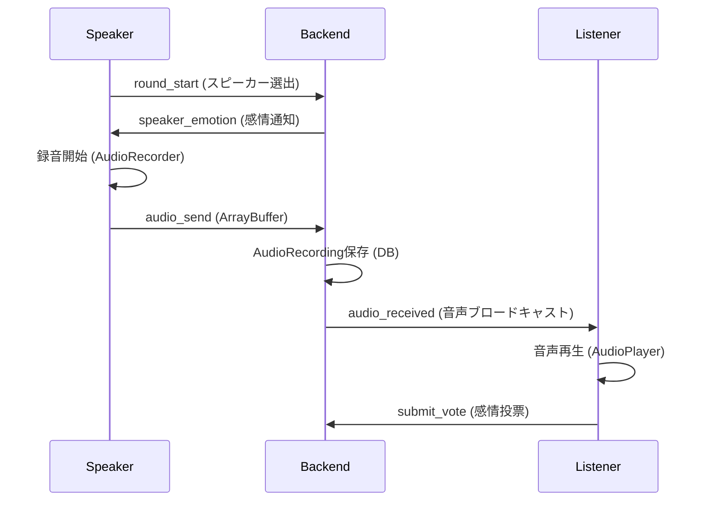

# 📁 EMOGUCHI プロジェクト構成 (音声機能対応版)

```
emoguchi/
├── frontend/                    # Next.js + TypeScript（React）
│   ├── app/                     # App Router ルート
│   │   ├── layout.tsx           # レイアウト設定
│   │   ├── page.tsx             # ホーム画面
│   │   └── room/[roomId]/       # 動的ルート（ルーム画面）
│   │       └── page.tsx
│   ├── components/              # UIコンポーネント
│   │   ├── AudioRecorder.tsx    # 🎤 音声録音コンポーネント（NEW）
│   │   ├── AudioPlayer.tsx      # 🔊 音声再生コンポーネント（NEW）
│   │   ├── LanguageSwitcher.tsx # 言語切替
│   │   └── *DebuggerComponent*  # デバッグ用コンポーネント群
│   ├── hooks/                   # カスタムフック
│   │   ├── useSocket.ts         # Socket.IO + 音声送信機能
│   │   └── useMediaRecorder.ts  # 🎤 MediaRecorder API統合（NEW）
│   ├── stores/                  # Zustand 状態管理
│   │   ├── gameStore.ts         # ゲーム状態 + 音声URL管理
│   │   └── localeStore.ts       # 言語設定
│   ├── lib/                     # ユーティリティ
│   │   └── translations.ts      # 多言語対応
│   ├── types/                   # TypeScript型定義
│   │   └── game.ts              # Socket.IOイベント型 + 音声型
│   ├── styles/                  # Tailwind CSS
│   │   └── globals.css
│   ├── socket/                  # Socket.IO接続
│   │   └── client.ts            # Socket.IO クライアント設定
│   └── public/                  # 静的ファイル
│
├── backend/                     # FastAPI + Socket.IO サーバー
│   ├── main.py                  # ASGIエントリポイント + 音声対応
│   ├── api/                     # REST API
│   │   ├── rooms.py             # ルーム管理API
│   │   └── debug.py             # デバッグAPI
│   ├── sockets/                 # WebSocket（Socket.IO）
│   │   └── events.py            # ゲーム + 音声イベント処理
│   ├── models/                  # Pydantic モデル
│   │   ├── game.py              # Player, Room, Round + AudioRecording（NEW）
│   │   └── emotion.py           # 感情定義
│   ├── services/                # 業務ロジック
│   │   ├── llm_service.py       # OpenAI LLM統合
│   │   └── state_store.py       # 状態管理 + 音声DB操作（NEW）
│   ├── simple_audio.py          # 🎵 シンプル音声リレー（NEW）
│   └── config.py                # サーバー設定
│
├── docs/                        # プロジェクト文書
│   ├── API仕様書.md             # REST + WebSocket + 音声API仕様
│   ├── ディレクトリ構成.md      # 本ファイル
│   ├── 技術選定.md              # 技術スタック説明
│   ├── 要件定義.md              # ゲーム要件 + 音声要件
│   └── 現在の問題点.md          # 解決済み音声実装要求
│
├── docker/                      # Docker設定
│   ├── frontend.Dockerfile      # Next.jsコンテナ
│   └── backend.Dockerfile       # FastAPIコンテナ
│
├── shared/                      # 共通定義（未使用）
├── docker-compose.yml           # 開発環境構成
├── CLAUDE.md                    # Claude Code 向け指示
├── README.md                    # プロジェクト概要
└── start_dev.sh                 # 開発サーバー起動スクリプト
```

## 🎵 音声機能追加ファイル

| ファイル | 用途 | 主要機能 |
|----------|------|----------|
| `frontend/components/AudioRecorder.tsx` | 音声録音UI | MediaRecorder統合、録音制御、視覚的フィードバック |
| `frontend/components/AudioPlayer.tsx` | 音声再生UI | Blob→URL変換、手動再生制御、エラーハンドリング |
| `frontend/hooks/useMediaRecorder.ts` | 録音ロジック | MediaRecorder API、WebM/Opus出力、状態管理 |
| `backend/models/game.py` | データモデル | AudioRecording, Player.mac_address, Round.audio_recording_id |
| `backend/services/state_store.py` | DB抽象化 | 音声録音保存・取得・削除メソッド |
| `backend/sockets/events.py` | 音声イベント | audio_send/audio_received処理、認証、ブロードキャスト |
| `backend/simple_audio.py` | 音声リレー | シンプルな音声データ転送（デバッグ用） |

## 🔌 Socket.IO イベントフロー（音声対応）



## 📦 依存関係 & 技術スタック

### フロントエンド追加依存
- MediaRecorder API (ブラウザ標準)
- Web Audio API (音声再生制御)
- FileReader API (ArrayBuffer変換)

### バックエンド追加依存
- `max_http_buffer_size: 10MB` (音声データ対応)
- バイナリデータ処理 (ArrayBuffer ↔ bytes)

### データベース対応
- AudioRecording テーブル (音声データ、感情、タイムスタンプ)
- Player テーブル拡張 (MACアドレス)
- Round テーブル拡張 (音声録音ID)
