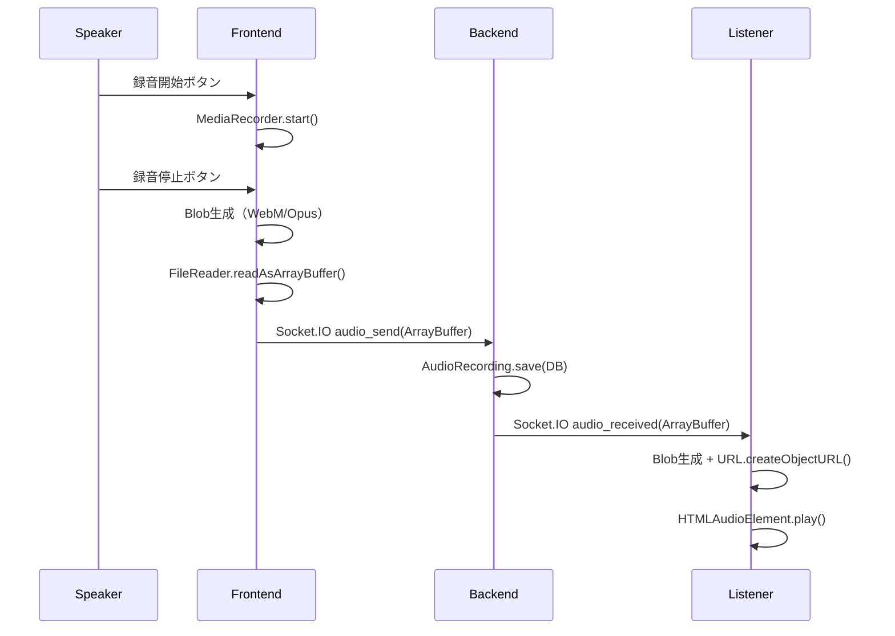

# 🎭 音声演技 × 感情推定ゲーム 要件定義書（音声録音・再生対応版）

> **実装状況:** ✅ 音声録音・再生機能実装済み  
> **最終更新:** 2026-01-10

## 🎮 ゲームモード

### 基本モード（Basic Mode）
8種類の基本感情からランダムまたは選択可能。

| **基本感情** |
|-------------|
| 喜び (Joy) |
| 期待 (Anticipation) |
| 怒り (Anger) |
| 嫌悪 (Disgust) |
| 悲しみ (Sadness) |
| 驚き (Surprise) |
| 恐れ (Fear) |
| 信頼 (Trust) |

---

### 応用モード（Advanced Mode）
以下の応用感情からランダムで8種を出題。
※複数の基本感情の組み合わせ

| **応用感情** | **構成** |
|-------------|-----------|
| 楽観 (Optimism) | 期待 + 喜び |
| 誇り (Pride) | 怒り + 喜び |
| 病的状態 (Morbidness) | 嫌悪 + 喜び |
| 積極性 (Aggressiveness) | 怒り + 期待 |
| 冷笑 (Cynicism) | 嫌悪 + 期待 |
| 悲観 (Pessimism) | 悲しみ + 期待 |
| 軽蔑 (Contempt) | 嫌悪 + 怒り |
| 羨望 (Envy) | 悲しみ + 怒り |
| 憤慨 (Outrage) | 驚き + 怒り |
| 自責 (Remorse) | 悲しみ + 嫌悪 |
| 不信 (Unbelief) | 驚き + 嫌悪 |
| 恥 (Shame) | 恐れ + 嫌悪 |
| 失望 (Disappointment) | 驚き + 悲しみ |
| 絶望 (Despair) | 恐れ + 悲しみ |
| 感傷 (Sentimentality) | 信頼 + 悲しみ |
| 畏敬 (Awe) | 恐れ + 驚き |
| 好奇心 (Curiosity) | 信頼 + 驚き |
| 歓喜 (Delight) | 喜び + 驚き |
| 服従 (Submission) | 信頼 + 恐れ |
| 罪悪感 (Guilt) | 喜び + 恐れ |
| 不安 (Anxiety) | 期待 + 恐れ |
| 愛 (Love) | 喜び + 信頼 |
| 希望 (Hope) | 期待 + 信頼 |
| 優位 (Dominance) | 怒り + 信頼 |

---

## 🔁 ラウンド進行フロー（音声録音・再生対応版）

| フェーズ | 主な処理 | 表示内容・実装状況 |
|---------|----------|-----------|
| ① セリフ & 感情決定 | LLMでセリフ生成、感情自動選択 | ✅ OpenAI API統合済み |
| ② スピーカー選出 | 自動で順番に決定 | ✅ speaker_emotionイベントでDM送信済み |
| **③ 音声録音フェーズ** | **スピーカーが音声録音** | **✅ AudioRecorder.tsx実装済み** |
| **④ 音声配信フェーズ** | **録音データをリアルタイム配信** | **✅ Socket.IO音声送信実装済み** |
| **⑤ 音声再生フェーズ** | **リスナーが音声を再生** | **✅ AudioPlayer.tsx実装済み** |
| ⑥ 投票フェーズ | リスナーが感情を4択/8択で投票 | ✅ 動的選択肢生成済み |
| ⑦ 結果表示 | 正解感情と得点を全体表示 | ✅ 正解発表・得点計算済み |

### 🎤 音声機能詳細
- **録音方式**: MediaRecorder API（WebM/Opus形式）
- **送信方式**: Socket.IO `audio_send` イベント（ArrayBuffer）
- **再生方式**: Blob URL生成 + HTML5 Audio
- **データ保存**: AudioRecording モデルでDB永続化対応

---

## 🎯 スコアリングルール

- **スピーカー**：当てられた人数 × 1pt
- **リスナー**：正解を当てたら +1pt

---

## 👥 プレイ人数

- 最小人数：2人（スピーカー1＋リスナー1）✅ 実装済み
- 最大：上限なし（パフォーマンスとUI制限による）✅ 実装済み

---

## 📡 通信・表示仕様（実装済み）

- ✅ WebSocket によるリアルタイム通信（Socket.IO）
- ✅ 感情データ：**スピーカーのみにDM送信** (`speaker_emotion`イベント)
- ✅ セリフテキスト：**全体に公開** (`round_start`イベント)
- ✅ **音声データ：リアルタイム配信** (`audio_send`/`audio_received`イベント)
- ✅ 投票結果・得点：**全体ブロードキャスト** (`round_result`イベント)

---

## ⚙️ オプション設定（実装済み）

- ✅ 使用モード：基本 / 応用（設定UI実装済み）
- ✅ 投票選択肢数：4択 or 8択（動的生成実装済み）
- ✅ スピーカー順：ランダム or 順番（ゲーム設定で選択可能）
- ✅ ラウンド数：1-10ラウンド（設定可能）

---

## 📝 実装完了項目

- ✅ **LLM セリフ生成API**: OpenAI GPT-4o 統合完了
- ✅ **WebSocket実装**: Socket.IO ルーム管理・音声配信実装完了
- ✅ **感情選択UI**: 動的選択肢生成実装完了
- ✅ **投票管理**: 非同期集計・結果表示実装完了
- ✅ **音声録音・再生**: MediaRecorder + Socket.IO バイナリ送信実装完了
- ✅ **データベース統合**: AudioRecording, MACアドレス対応
- ✅ **UI/UX**: AudioRecorder/AudioPlayer コンポーネント実装完了

## 🎵 音声機能の技術詳細

### 録音→送信→再生フロー

### 技術仕様
- **音声形式**: WebM container + Opus codec
- **品質設定**: echoCancellation + noiseSuppression 有効
- **転送方式**: Socket.IO バイナリイベント（最大10MB対応）
- **ストレージ**: PostgreSQL BYTEA（将来的に外部ストレージ移行可能）

## 💡 ゲーム名

| タイトル | 意味・ニュアンス |
|----------|------------------|
| **エモグチ！（EMOGUCHI!）** | 感情（Emotion）＋ 口（Speech）+ 音声録音対応 |
---
